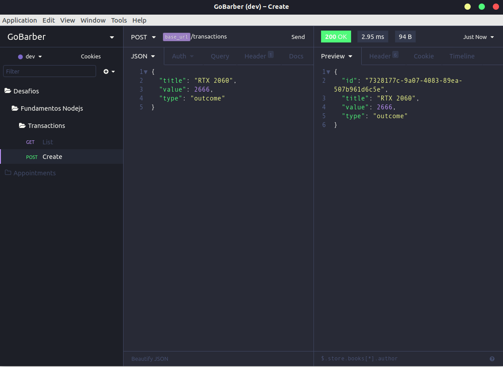
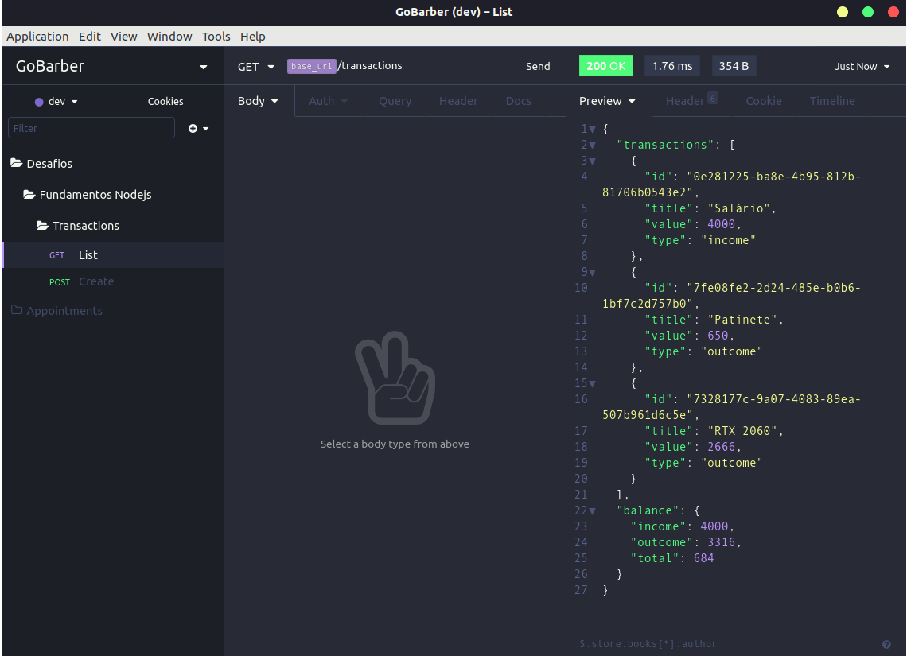

# Desafio 05: Fundamentos Node.js - GoStack Bootcamp
Desafio proposto em que se deve criar uma aplicação para treinar os conceitos de Node.js com TypeScript aprendidos até então, utilizando o conceito de models, repositories e services.

### Sobre
O desafio consiste em criar uma aplicação para armazenar transações financeiras e mostrar o balanço ao final das transações.Deve Conter:
- Entrada e saída
- Permitir o cadastro e a listagem dessas transações.
- Tratar erro em caso de transação de saída menor que o valor armazenado;

### Resultado

